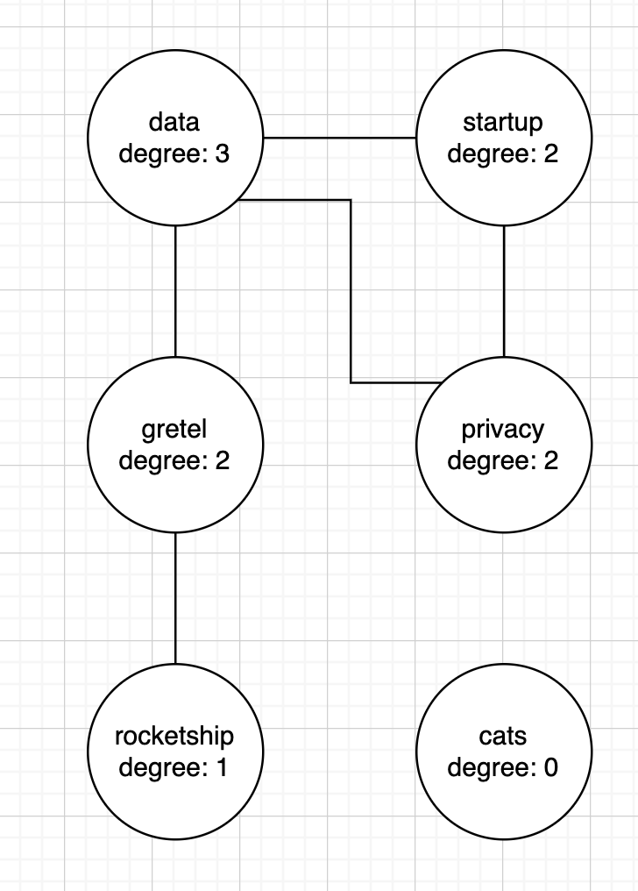

<!--  -->
# Tweets Hashtags Calculator

This application calculates how related a set of tweets are by constructing a graph based on hashtags. It is implemented in Java.

## Example
The graph below can be constructed from the following tweets (showing hashtags only):

- `#Gretel #data`
- `#data #startup #privacy`
- `#data`
- `#gretel`
- `#rocketship #Gretel`
- `#cats #cats #cats`

**Average Degree Calculation:**

(3 + 2 + 2 + 2 + 1) edges / 6 nodes = ~1.67

<!--  -->

---

## Installation and Setup

### Install Maven
#### Windows
Follow the instructions in the [Maven Installation Guide](https://maven.apache.org/install.html).

#### macOS
```sh
brew install maven
```

#### Verify Maven Installation
```sh
mvn -v
```

### Build and Run the Project
```sh
mvn clean package
java -cp target/graph-1.0-SNAPSHOT.jar com.example.gretel.tweets.GraphCalculator
```

---

## Usage

When you launch the calculator, you can use the following commands:

### `init`
Initializes the tweet graph. By default, it uses the file located at `src/main/java/com/example/gretel/static/tweets.txt`.

### `add`
Adds a new tweet to the graph. Input format: `#tag1,#tag2,#tag3`.

### `remove`
Removes an existing tweet. If the tweet does not exist, the command returns `false`. Input format: `#tag1,#tag2,#tag3`.

### `list-all`
Lists all existing tweets. By default, it shows the first 100 tweets.

### `avg`
Calculates and displays the average degree of the graph.

### `help`
Displays information on how to use the calculator.

### `exit`
Exits the calculator.

---

## Key Design Considerations

### Storing the Graph in Memory
The graph is stored using two maps: one for edges and one for nodes. The structure assumes:

1. An average of 3 hashtags per tweet.
2. Each hashtag consists of ~10 characters.
3. Each character in UTF-16 takes 2 bytes.
4. Each key (concatenation of three strings) consumes:
   - `3 * 10 * 2 = 60 bytes` for characters.
   - `3 * 40 = 120 bytes` for object overhead.
   - **Total key size: ~180 bytes.**
5. Each value (integer count) takes:
   - `4 bytes` for the integer.
   - `16 bytes` for the object overhead.
   - **Total value size: ~20 bytes.**
6. HashMap entry overhead: `32 bytes`.

**Total estimated size per entry:**

```
180 (key) + 20 (value) + 32 (entry) = 232 bytes.
```

For **100 million unique edges**, the estimated memory usage is **~29.6GB**, which is manageable on modern hardware.

### Efficient Average Degree Calculation
We maintain the total number of nodes (`N`) and edges (`E`) in memory. Updates occur in **O(1) time complexity**, allowing instant average degree calculations.

### Optimized Parsing Logic
The original tweet data contains redundant information, but our application only requires hashtags. To improve efficiency, we utilize JsonParser with token-based parsing to directly extract the hashtags section, eliminating the need to parse the entire JSON tree. This approach significantly reduces memory usage and processing time.

For more details, refer to the implementation in `GraphCalculator.initGraphCmd`.


### Parallel Graph Construction
Observations from data analysis:
- Many tweets have duplicate hashtags.
- Some tweets have no hashtags.

Instead of processing tweets sequentially, we build the graph in parallel using concurrency-safe data structures:

```java
private final Map<String, Integer> nodesCount = new ConcurrentHashMap<>();
private final Map<String, Integer> edgeMap = new ConcurrentHashMap<>();
private final Map<String, Integer> tagsCount = new ConcurrentHashMap<>();
private final AtomicInteger E = new AtomicInteger(0);
private final AtomicInteger N = new AtomicInteger(0);
```

- `nodesCount` stores node information.
- `N` tracks the total number of nodes.
- `edgeMap` stores edge relationships.
- `E` tracks the total number of edges.

By leveraging concurrency, performance is improved by **100%**, as confirmed through load testing.

For further details, refer to the implementation in `HashtagGraph.java`.

---

## Future Improvements
- Implement persistent storage for scalability. e.g., Redis or Dynamo DB.
- Optimize memory usage further using compact data structures.
- Support real-time streaming data updates.

Feel free to contribute or raise issues for discussions! 🚀

